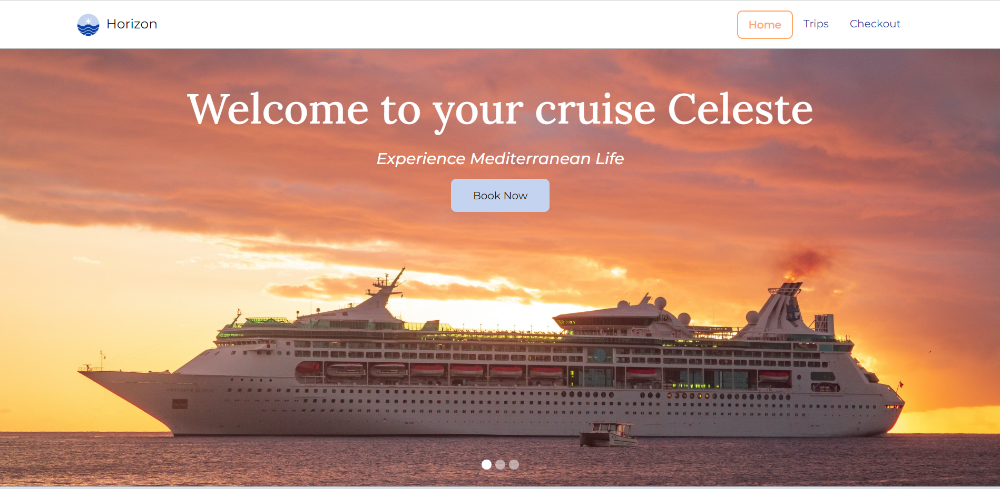
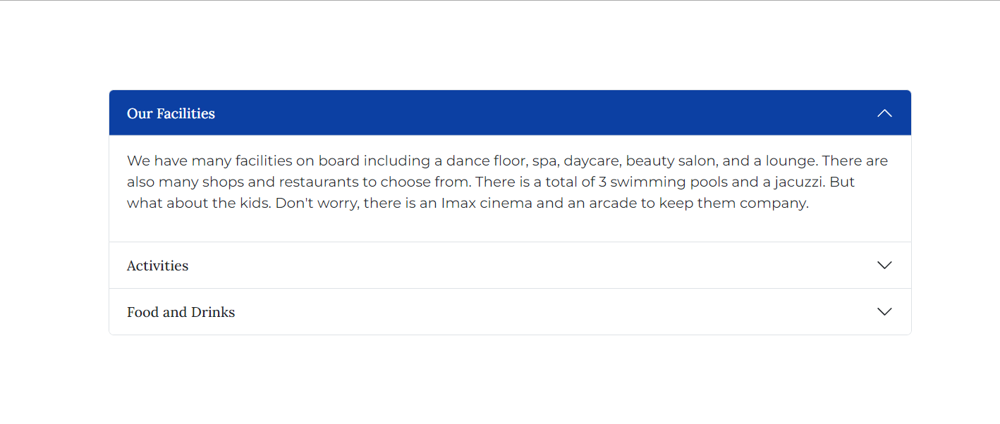
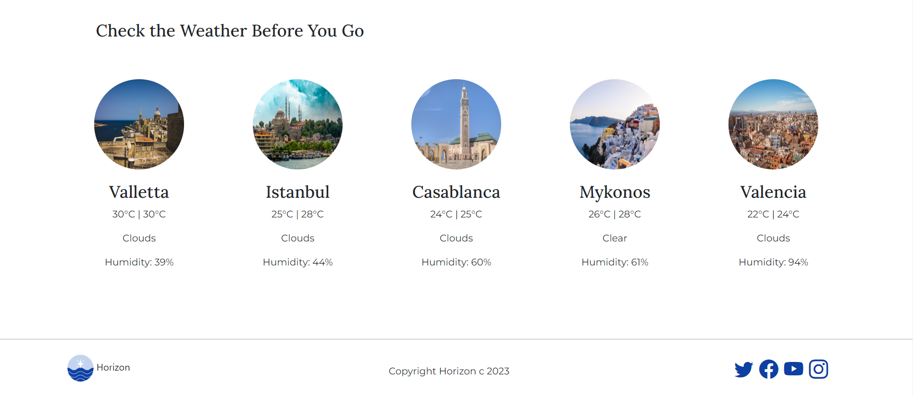
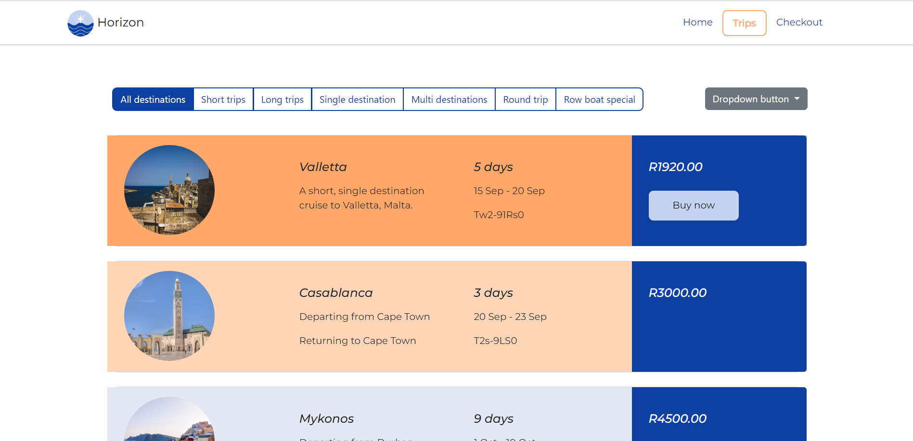
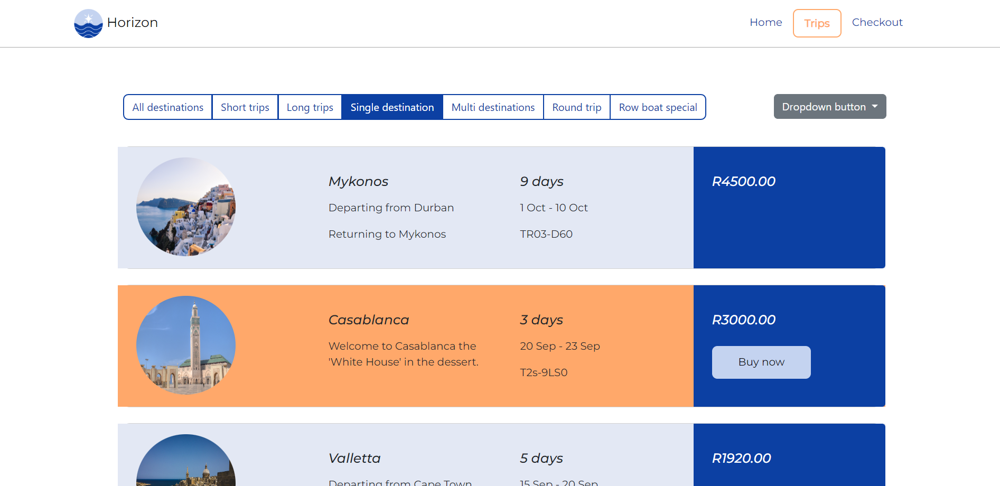
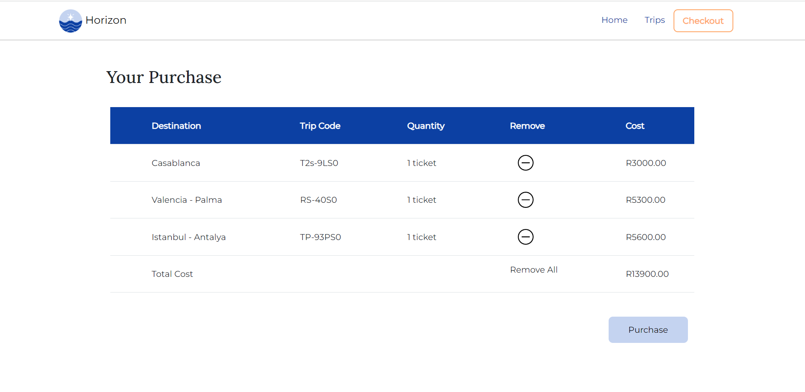
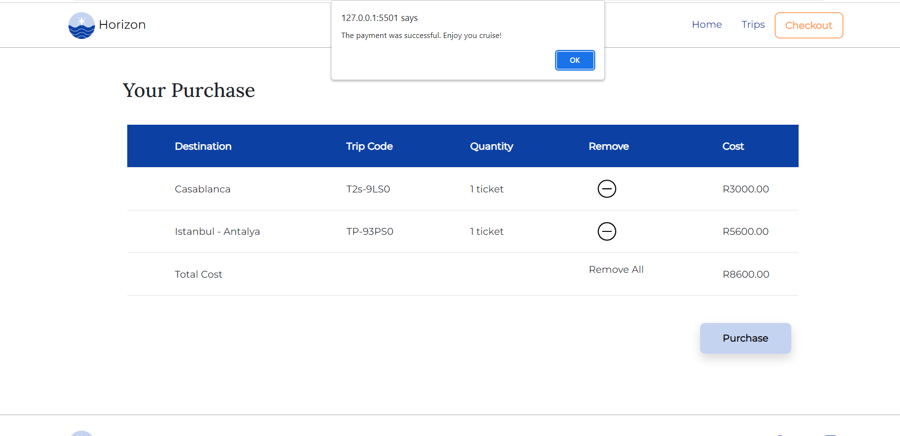

# Welcome to Horizon Cruises
### Horizon Cruses is a Mediterranean cruise booking site. Users can easily browse from a selection of trip options and add it to their cart. They can also remove items from their cart.

 

---
# Homepage
### The homepage has various features, including a carousel, an accordion, and a weather section. The weather section displays the city names, minimum and maximum temperatures, weather state, and humidity levels.

## *Homepage Carousel*

## *Accordion*

## *Weather Widgets*

#### That is all for the homepage. Let's take a look at the Trips Page.
 

---
# Trips Page 
### The trips page has various filtering and sorting options to choose from. The user can select multiple trips and if they're ready they can click the buy now buttons to take them to their cart.
 

## *Trips View*

 

---
# Checkout Page
### The user can remove certain items from the cart or they can remove all the items if they wish. When the user is done making the payment a pop up appears and they get redirected to the homepage. 
 

## *Cart View*

 

## For an in depth view of the website's functionality watch the walkthrough video below:

### [Walkthrough Video](https://www.loom.com/share/c230a61bbb154b07bff72805a9d50b79?sid=7cae9f34-d5d9-45c5-8ab6-312678e7294c)

 

---

# **Getting Started**
#### Login to your Github account and simply download the code or clone it to your local device.
 

# **Built With:**
* [Bootstrap CDN](https://www.bootstrapcdn.com/)
* Javascript
* [JQuery](https://ajax.googleapis.com/ajax/libs/jquery/3.7.0/jquery.min.js)
* JSON
* [Open Weather API](https://openweathermap.org/current)
 

# **Contributing**
#### Currently, on the trips page, if the card is clicked the information gets pushed to an array, which is ultimately saved to locale storage. The code can be improved by pushing the information to the array only when the card is active. Otherwise, the information is pushed to the array whenever the card is clicked regardless if it is selected. And there is probably a better way of storing the information to locale storage. 
 

# **Author**
#### Celeste Van Tonder
 

# **License**
#### [MIT License Agreement](../final-submission-t3/LICENSE)

 

# **Acknowledgements**
* Unsplash for photos
* Pexels for photos
* [Bootstrap Icons](https://cdn.jsdelivr.net/npm/bootstrap-icons@1.10.5/font/bootstrap-icons.css)
* [Google Fonts](https://fonts.googleapis.com/css2?family=Lora:wght@500&family=Montserrat:ital,wght@0,400;1,500&display=swap)
#### Thanks to my sister, Loraynne, and friend, Tarryn, for all their support. I would also like to thank my lecturers and doctor google.
